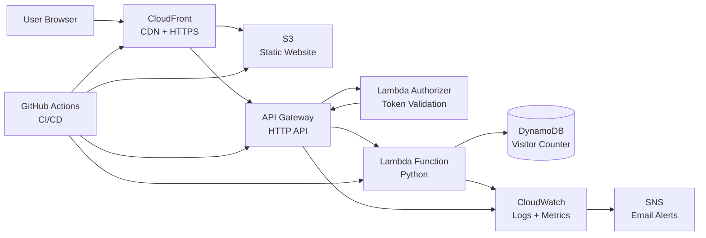

# Cloud Resume - Production Serverless Application (AWS)

## Live Demo

- Custom Domain: https://petkokolev-cloud.com  
- CloudFront (HTTPS): https://d24i00e0pp817c.cloudfront.net  
- S3 Website Endpoint: http://petko-cloud-resume-1.s3-website.eu-west-2.amazonaws.com/

---

## Overview

A production-style serverless application built on AWS that serves a personal resume with a dynamic visitor counter.

This project goes beyond a static site by implementing:

* Infrastructure as Code with Terraform
* CI/CD pipelines with GitHub Actions
* Secure API with Lambda Authorizer
* Monitoring, logging, and alerting using CloudWatch
* Rate limiting and resilience testing under load

---

## Architecture Diagram

---

## Key Features

1. Frontend & Delivery

* Static website hosted on S3
* Global distribution via CloudFront
* Custom domain with HTTPS (ACM + Route 53)

2. Serverless Backend

* REST API using API Gateway (HTTP API)
* Lambda function for business logic
* DynamoDB for persistent storage
* Atomic updates for accurate visitor counting

3. Security

* Custom Lambda Authorizer for API protection
* Token-based authentication via headers
* Strict CORS policy for allowed domains

4. Performance & Protection

* API Gateway throttling (rate + burst limits)
* Protection against excessive traffic
* Load testing performed using parallel requests

5. Observability

* Structured logging in Lambda (JSON-style events)
* CloudWatch Logs for request tracing
* CloudWatch Alarms for:
    * API 4xx errors
    * API 5xx errors
    * Lambda failures
* SNS notifications for real-time alerts

---

## CI/CD Pipeline

Backend Pipeline

* Runs Pytest unit tests
* Packages Lambda functions
* Deploys infrastructure via Terraform
* Auto-applies changes on push to main

Frontend Pipeline

* Syncs frontend files to S3
* Invalidates CloudFront cache

---

## How It Works (Request Flow)

1. User loads website via CloudFront
2. Frontend sends request to API Gateway
3. Lambda Authorizer validates request
4. Lambda function:
    * Reads current count from DynamoDB
    * Increments value atomically
5. Updated count returned to frontend
6. Logs + metrics sent to CloudWatch

---

## Monitoring & Debugging

* Real-time logs via CloudWatch Log Groups
* Request-level tracing using request IDs
* Logs include:
    * Route + method
    * Status codes
    * Execution time
* Failures trigger CloudWatch Alarms + SNS alerts

---

## Tech Stack

Frontend

* HTML, CSS, JavaScript

Backend

* AWS Lambda (Python)
* API Gateway (HTTP API)
* DynamoDB

Infrastructure

* Terraform
* AWS S3, CloudFront, Route 53, ACM
* IAM

DevOps

* GitHub Actions
* Pytest

---

## Challenges & Solutions

| Problem | Solution |
|--------|---------|
| CloudFront caching stale data | Implemented cache invalidation |
| IAM permission errors | Fixed least-privilege role policies |
| Terraform pipeline failures | Debugged CI/CD and state configuration |
| API logging failures | Configured CloudWatch roles correctly |
| Rate limiting under load | Applied API Gateway throttling |

---

## Key Learning

* Designing real-world serverless architectures
* Implementing secure APIs with authentication
* Debugging distributed cloud systems
* Using logs vs metrics effectively
* Automating infrastructure with Terraform
* Building CI/CD pipelines from scratch

---

## Future Improvements

* CloudWatch dashboards for better visualisation
* Introduce SQS for async processing
* Improve IAM policies (least privilege)
* Expand test coverage (integration tests)
* Modularise Terraform configuration

---

## Why This Project Matters

This project demonstrates:

* Real-world AWS architecture design
* End-to-end DevOps workflow
* Production-style monitoring & alerting
* Strong debugging and problem-solving skills
